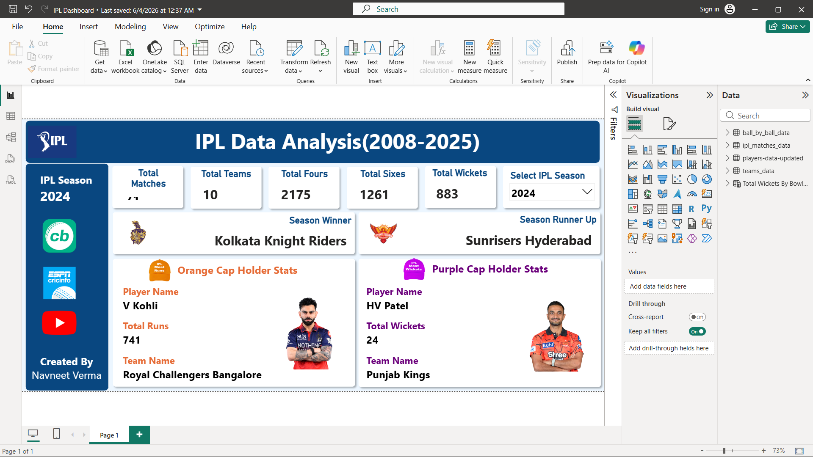

# 🏏 IPL Data Analysis Dashboard (2008–2025)

## 📌 Project Overview

This project is an interactive Power BI dashboard built to analyze Indian Premier League (IPL) data from 2008 to 2025.

The dashboard provides season-wise insights into team performance, player statistics, tournament winners, Orange Cap and Purple Cap holders, and key IPL metrics through interactive visualizations.

---

## 🚀 Dashboard Preview



---

## 📊 Key Features

### Tournament Overview
- Total Matches Played
- Total Teams Participated
- Total Fours
- Total Sixes
- Total Wickets

### Season Analysis
- Season Winner
- Season Runner-Up
- Season-wise Filtering

### Player Performance Analysis
- Orange Cap Holder Statistics
- Purple Cap Holder Statistics

### Interactive Dashboard
- Dynamic Season Slicer
- KPI Cards
- Team & Player Insights

---

## 🛠️ Tools & Technologies

- Power BI
- DAX
- Power Query
- CSV Dataset
- Data Modeling

---

## 📂 Dataset Used

The analysis is based on IPL historical datasets including:

- Match Data
- Ball-by-Ball Data
- Player Statistics
- Team Information

---

## 📈 Insights Generated

- Season champions across IPL history
- Highest run scorers by season
- Highest wicket takers by season
- Team performance trends
- Batting and bowling statistics

---

## 📁 Project Structure

```text
IPL-Data-Analysis-PowerBI/
│
├── IPL Dashboard.pbix
├── README.md
├── screenshots/
│   └── dashboard.png
├── ball_by_ball_data.csv
├── ipl_matches_data.csv
├── players-data-updated.csv
└── teams_data.csv
```

## 👨‍💻 Author

**Navneet Verma**

- GitHub: https://github.com/navneetverma2004

---

## ⭐ If you found this project useful, consider giving it a star.
